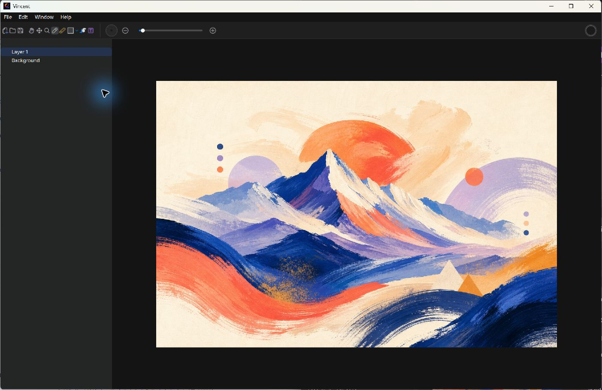

# Vincent 4.0

Vincent 4.0 is a private, local-first raster drawing app built with Qt 6 and
QML. It provides a focused desktop canvas for drawing, handwriting, layered
raster editing, and PSD-compatible import and export. A purchased Vincent
license is verified online with the account email and receipt/dashboard key;
documents remain local and Vincent contains no telemetry, analytics, ads, or
automatic/background update checks. Updates run only after explicit user actions.

The painting surface is backed by the installed iiSharedCanvas mixed-document
canvas. See [docs/SHARED_CANVAS.md](docs/SHARED_CANVAS.md) for the native
raster/vector/timeline contract, `.iisc` persistence boundary, verification
gates, and remaining session-object migration scope.



_Vincent 4.0 on Windows editing a sample raster artwork. The artwork is a
demonstration asset; the surrounding interface is the running application._

## System Requirements
- macOS 12 or later (Apple Silicon or Intel)
- Windows 10 or later when using the Windows package
- Linux builds are available when provided by the release page

## License activation

Enter the verified iisacc account email and Vincent license key on first launch.
Vincent sends them only in the JSON body of a direct HTTPS request to
`iisacc.com` and unlocks the canvas only after an authoritative Boolean
response for product `vincent`. A successful license is remembered on macOS in
Keychain and on Windows in Credential Manager, then checked online
automatically on later launches. Plaintext credential fallback is disabled.
An invalid server decision removes the saved credential; an offline or 5xx
response keeps it for the **Retry saved license** action. While the canvas is
still locked, **Use another license** forgets that saved credential and returns
to the form. It is intentionally unavailable after the canvas opens so an
in-progress document cannot be discarded. Vincent waits for secure storage to
finish before completing first activation; if storage alone fails, the current
verified session opens with a persistent reminder that the key must be entered
again next time. Linux has no supported secure
credential backend in this release and therefore requires manual activation
each launch. No document content is included in license requests.

## Manual updates

Vincent performs no update polling, startup check, scheduled request, or retry.
Website and Developer ID distributions expose **Help → Check for Updates…** to make one small manifest request to
`iisacc.com`. If a newer version is available, nothing is downloaded until you
choose **Update now**. That second action reads the existing secure license,
requests one short-lived download grant, downloads the platform installer to a
temporary file, checks its declared size and SHA-256 plus the current platform
safety policy, and opens the verified installer. The notarized macOS package is
checked against Apple signing/notarization policy. The current Windows MSI is
explicitly unsigned, so its server-issued download-grant SHA-256 and unsigned-package
disclosure remain mandatory until a trusted Authenticode release replaces it.
Email, license key, temporary path, and signed
download URL never enter QML. Vincent does not quit automatically after opening
the installer: save current work, follow the installer instructions, and close
Vincent only when ready. Cancelling stops the active update flow without a retry.
Mac App Store builds carry an `appstore` distribution marker and also detect an
App Store receipt; Windows Store/MSIX builds detect their package identity.
Those store-managed installations hide the self-update action and reject its
C++ check/update methods without making a request, so updates remain exclusively
owned by the App Store or Microsoft Store.

## Install (macOS)
1. Download `Vincent-4.0.5-macOS.pkg` through your authorized iisacc.com account delivery.
2. Double-click the installer and follow the prompts to install Vincent 4.0 in Applications.
3. Open Vincent 4.0 from Launchpad or the Applications folder.

## Build from source (Linux)
Vincent supports Linux source builds, but no public Linux binary archive is currently offered. Configure and build the tagged source with the required Qt, LVRS, iiPaintEngine, and iiSharedCanvas dependencies; the packaging target collects the Qt, LVRS, iiPaintEngine, and iiSharedCanvas shared runtimes, and an installed tree provides `bin/Vincent` plus a `Terminal=false` desktop entry for launching only the GUI on X11 and Wayland.

## Install (Windows)
Vincent 4.0.5 is distributed from iisacc.com as an unsigned x64 MSI through December 31, 2026. It contains the same online license manager as the notarized macOS build, but it has no Authenticode publisher identity. Windows may therefore display **Unknown publisher** or a Microsoft Defender SmartScreen warning. Download it only through the authenticated Vincent account page and compare the SHA-256 shown there before opening it.

The Windows Installer 5 package uses the official `ALLUSERS=2` and `MSIINSTALLPERUSER=1` dual-context defaults, so 4.0.5 installs for the current user and upgrades the existing per-user 4.0.0 in the same installation context without a UAC prompt. Choose **Advanced** on a first installation to select current-user or all-users scope; all-users scope also exposes the destination directory, installs under native 64-bit Program Files by default, creates a shared shortcut, and requires elevation, while current-user scope stays under Local Application Data. The application files and context-aware Start Menu shortcut are installed together. A required installation-context marker keeps later upgrades in the registered scope and preserves the recorded install location; when Windows Installer detects a markerless per-user upgrade, it also locks that legacy upgrade to current-user scope. Packaging explicitly validates this model with ICE105. ProductCode is deterministic for the same version and architecture, so rebuilding unchanged 4.0.5 cannot register a duplicate product, while a different version or architecture receives a distinct identity. If both scope registrations are discovered, new installation and cross-context upgrade are rejected, but maintenance and removal remain available so the machine can be recovered. After that product is installed, opening the same MSI intentionally enters the standard Windows Installer maintenance flow instead of presenting another **Install** action. Use **Repair** to restore missing or damaged installed files and **Remove** to uninstall Vincent; the standard **Change** path displays the required installed feature state. Remove the installed product first only when changing installation scope or exercising a genuinely fresh first-installation flow.

Through 2026, maintainers create the public unsigned MSI with `powershell -ExecutionPolicy Bypass -File .\build-windows.ps1 -BuildType Release -AllowUnsignedPackage -SkipPackage -CreateMsi`. This mode requires the complete test suite, public corresponding-source URL/hash, complete legal materials, MSI database validation, an authenticated SHA-256 sidecar, and a build date before 2027. It emits `build/Vincent-4.0.5-Windows-unsigned.msi`; it never pretends that the file has a publisher signature. Trusted builds continue to use `-Sign` or `-ExternalSigning` and the existing Authenticode verification gates.

For the certificate-free public Store route, maintainers reserve the app in Partner Center, copy its exact reserved display name plus the three Product identity values, provide the corresponding-source URL/hash, and run `build-windows-store.ps1 -Mode Store`. The reserved name must populate both package and application display names; an unreserved value fails Partner Center validation. iiPaintEngine is licensed by its copyright holder as `AGPL-3.0-only`, and that exact text is staged with the package. The command creates the intentionally unsigned `dist/Vincent-4.0.5-Windows-Store-x64.msixupload` for Partner Center ingestion; it is not a public package until Microsoft accepts, signs, and publishes it. The Store does not re-sign MSI or EXE submissions. See [docs/BUILD.md](docs/BUILD.md) for account onboarding, local self-signed MSIX validation, restricted-capability justification, and submission steps.

## Code signing policy

Vincent is seeking free code signing provided by [SignPath.io](https://signpath.io/), with a certificate sponsored by [SignPath Foundation](https://signpath.org/). No SignPath Foundation certificate is currently active for Vincent. The GitHub workflow therefore publishes an explicitly named unsigned website artifact through 2026 and submits to SignPath only when an authorized maintainer deliberately enables the signing input after Foundation approval. The temporary unsigned file is distributed with an authenticated checksum and an explicit Unknown publisher disclosure; the signed result remains the preferred successor.

- Committer and reviewer: [iisacc-Justmoong](https://github.com/iisacc-Justmoong)
- Approver: [iisacc-Justmoong](https://github.com/iisacc-Justmoong)
- Privacy: Vincent transfers only the purchaser-entered account email, license key, and fixed `vincent` product ID to `https://iisacc.com/api/account/license/validate` for activation and launch verification. Documents and editing activity stay local; Vincent contains no telemetry, analytics, advertising, polling, or automatic update checks. A manual **Check for Updates…** makes one version-manifest request; **Update now** alone authorizes and downloads a verified installer.
- System changes: the MSI announces installation scope and destination, installs the application and Start Menu shortcut together, and provides standard Windows Installer repair and removal.

After SignPath approval and signature verification, the externally signed website release will replace the temporary unsigned file. Its embedded Authenticode signature will supply publisher identity and integrity.

A valid trusted Authenticode signature replaces the Windows unknown-publisher identity with the certificate publisher, but Microsoft Defender SmartScreen also evaluates publisher reputation and per-file reputation, so a new release hash may still warn. A checksum proves file equality only when obtained through an authenticated release channel; it does not prove publisher identity by itself. Self-signed certificates are not suitable for public distribution. ZIP and MSI packaging also stages Vincent/LVRS and iiPaintEngine AGPL texts, QtKeychain BSD-3-Clause terms, psd_sdk/miniz, Pretendard, Qt, and MinGW legal materials plus Qt SPDX documents. Public signing still requires a publisher-controlled corresponding-source URL and SHA-256.

The generic Windows CPack target does not run Qt deployment, PE closure validation, or Authenticode signing. Its deliberately named `Vincent-4.0.5-Windows-unsigned-cpack-incomplete.zip` output is build-system diagnostics only and must never be published.

The Windows executable is a native AMD64 PE32+ GUI-subsystem application, so its lifetime is owned by the Qt GUI event loop rather than a companion terminal. QML completes the hidden 1400x880 launch geometry, C++ bounds that hidden size once to the screen's available area, and then shows the window once; no post-display resize runs while the heavier canvas page is activated through an asynchronous QML `Loader`. The window remains user-resizable after launch. Executable resources include the application icon, Windows file/product version information, an `asInvoker` manifest, Windows 10/11 compatibility, Per-Monitor V2 DPI awareness, and long-path awareness. The Release staging pass verifies those native properties and the required runtime DLLs, rejects incompatible MinGW runtimes, strips only Vincent-owned MinGW binaries, omits unused Qt generic, Insight Tracker, SQL, Quick3D utility, software OpenGL, and runtime shader-compiler payloads, and removes a loose `qml/LVRS` copy because LVRS QML is already embedded in `LVRS.dll`.

Normal startup performs no startup-log file I/O. To diagnose launch timing from a GUI-subsystem build, set `VINCENT_STARTUP_TRACE=1` before running `Vincent.exe`; milestone records are then appended to `%TEMP%\Vincent-startup.log`. A fatal failure to create the root QML object is recorded there even when tracing is disabled.

## Features at a Glance
- iiPaintEngine-backed brush and eraser strokes with native pointer/tablet event handling and pressure-controlled brush opacity
- Layered raster document model with a base raster canvas plus selectable transparent raster layers; blank documents start with `Background` plus a selected transparent `Layer 1`, each backed by its own iiPaintEngine surface and undo/redo state
- Image open flow through Qt image formats such as PNG, JPEG, BMP, GIF, WebP, and TIFF plus PSD files read through `psd_sdk`; importable 8-bit RGB/RGBA PSD layers reopen as Vincent raster layers, and every flat image open replaces the raster canvas at the source image dimensions without fitting the image into the previous canvas
- Raster save flow that composites the base canvas, current raster layers, and current image, text, and shape objects
- Internal PSD compatibility document layer that maps the raster canvas and current session objects into Photoshop-style layer records and XMP metadata
- LVRS-backed MVVM document state with a compact C++ canvas document view model
- Toolbar file actions expose new canvas, open image, and save image buttons; new canvas opens a width/height modal before creating the raster
- The application window exposes File, Edit, Window, and Help menus. Qt 6.8 uses the native macOS global menu bar, while Windows and Linux use a compact dark in-window menu bar whose 22-DIP height and background match the application; all variants preserve the existing canvas dialogs, undo/redo, layer actions, tool and shape selection, brush-size changes, canvas view controls, window controls, and complete shortcut reference entries
- Platform builds use `resources/Appicon.icns` as the canonical macOS icon source and `resources/Appicon.ico` for Windows executable resources; run `tools/sync_app_icon_assets.sh` after replacing the macOS icon so the App Store/Xcode asset catalog stays in sync
- Save image defaults to Photoshop PSD and also offers PNG, JPEG, BMP, WebP, and TIFF; PSD export writes a merged preview plus the current `Background` canvas layer when present, current raster layers, and current image/text/shape objects in bottom-to-top order so Photoshop presents `Background` at the bottom, with Vincent layer metadata embedded as XMP
- A docked left-side LVRS hierarchy panel lists the background raster canvas and current image, shape, text, and raster layers; new blank canvases select the initial transparent `Layer 1` so brush strokes land on an editable layer immediately, double-clicking a layer name edits it inline, dragging rows changes layer order, and the plus/minus footer buttons create or remove layers, including the background layer; when `Background` is removed, the canvas shows a tiled PNG-style transparency grid
- Layer creation uses an incremental visual model so adding many raster layers does not recreate existing layer surfaces or write PNG snapshots for unchanged layers
- Pan, move, zoom, brush, eraser, shape, fill bucket, and paint-style text tools with a dense full-width top toolbar placed directly below the menu bar on Windows, toolbar-frame and button x-axis padding set to half the y-axis padding, a current-color swatch with 4x right-edge padding that opens the HSL color picker, and brush controls that also set text size and text color
- Canvas cursors follow the effective tool: brush and eraser hide the system pointer and show a scene-graph vector circle whose diameter matches the current tool size at the active canvas zoom; subpixel footprints retain the exact circle and fall back to the system crosshair so the pointer cannot disappear; zoom and shape use a precision crosshair; text uses an I-beam; fill uses a pointing hand; pan uses open/closed hands; and move uses the arrow over empty canvas, four-way movement over object bodies, and directional resize cursors only over the selected object's resize handles
- Pan mode moves the canvas in the workspace by grabbing it with the hand tool, using viewport-relative movement offsets for smoother dragging; holding Space temporarily enters pan input without changing the selected tool
- Zoom mode scales the canvas by dragging horizontally anywhere in the canvas workspace: right to zoom in, left to zoom out
- Drag-to-insert solid shapes for rectangle, ellipse, triangle, diamond, star, rectangle bubble, and ellipse bubble, with Shift-constrained 1:1 bounds
- Clipboard images and local image files copied from the system file manager can be pasted with Command/Ctrl+V as centered, separately selected image-layer objects. Local image files dragged from Finder or another file manager and images dragged from a website can also be dropped directly onto the canvas; Vincent centers the new layer at the drop point, switches to the move tool, and highlights the canvas border while an acceptable image is hovering. Text and layer-name editors retain their native text paste behavior.
- Every pasted or dropped image is copied into the same content-addressed local PNG cache, fitted inside 80% of the canvas without stretching, and exposed to the existing movement, resize, reorder, delete, PSD, and raster-export behavior. Vincent validates decoded dimensions before reading pixel bytes, caps input at 32,768 pixels per side and 64 megapixels, verifies cache hits, and writes new entries atomically. Web-image fallback accepts only HTTP(S), follows only no-less-safe redirects, times out after 30 seconds, caps downloads at 64 MB, and does not retain URL credentials, query parameters, fragments, or data URLs in layer metadata.
- Missing, malformed, oversized, unavailable, or unwritable image input leaves pending text, current objects, selection, and tool untouched and displays a transient reason instead of failing silently.
- Repeated pastes of the same cached image receive alternating 16-pixel diagonal offsets, preventing a successful duplicate from being hidden exactly beneath the current object.
- Inserted image, shape, and text objects are created as separate layer rows, can be selected with the move tool, dragged or resized past the canvas bounds from enlarged corner and edge transform handles while their visible pixels stay clipped to the canvas, Shift-dragged along the dominant straight movement axis, Shift-resized with their original aspect ratio, and deleted with Delete or Backspace before raster export
- Global menu shortcuts cover every actionable menu item: Command/Ctrl+N/O/S for new/open/save-as, Command/Ctrl+V for clipboard-image paste, Command/Ctrl+Z and platform redo for history, Command/Ctrl+Shift+N/Delete for layer creation/deletion, B/E/H/V/Z/U/G/T for tools, Command/Ctrl+Alt+1..7 for shape kinds, [/] for brush size, and Command/Ctrl+0/1/M plus platform fullscreen for window controls. Tool shortcuts also support matching two-beolsik Korean key positions on the canvas.
- Default brush hardness keeps iiPaintEngine's coverage-based edge anti-aliasing at its maximum app setting
- LVRS solid chrome keeps native window controls. Windows and Linux use their native title bars without a redundant logical drag region or toolbar gap; macOS reserves the LVRS drag surface only for its full-size content title bar in normal-window mode and removes it in full screen
- Initial canvases are created inside the workspace with proportional top, side, and bottom margins so the dark workspace remains visible, while new canvases use the dimensions entered in the toolbar modal
- Large new canvases are automatically zoomed down on creation so the full canvas remains visible inside the current workspace viewport

## Community and Contributing

- Join [GitHub Discussions](https://github.com/iisacc-Justmoong/Vincent/discussions) for general feedback, questions, and ideas.
- Report reproducible defects through [GitHub Issues](https://github.com/iisacc-Justmoong/Vincent/issues).
- Help validate Vincent 4.0.5 through the [Windows 10/11 testing issue](https://github.com/iisacc-Justmoong/Vincent/issues/18).
- Read [CONTRIBUTING.md](CONTRIBUTING.md) before proposing code, QML, documentation, or release-workflow changes.

## Testing
```bash
cmake -S . -B build -DBUILD_TESTING=ON
cmake --build build --target Vincent tests_canvasdocumentviewmodel tests_drawingsurfaceitem
ctest --test-dir build --output-on-failure
```

## Known Limitations
- PSD import reads 8-bit RGB/RGBA raster layers, layer names, bounds, opacity, visibility, Photoshop blend-mode keys, and Vincent XMP manifests when present; Photoshop smart objects, adjustment layers, layer effects, and editable text/vector reconstruction still fall back to raster compatibility data
- Transformable image objects remain session overlays when present, while added paint layers own their own raster pixels for deletion and export
- Palette is fixed to the built-in colors
- Canvas dimensions are clamped to the supported raster size range when entered through the new-canvas modal
